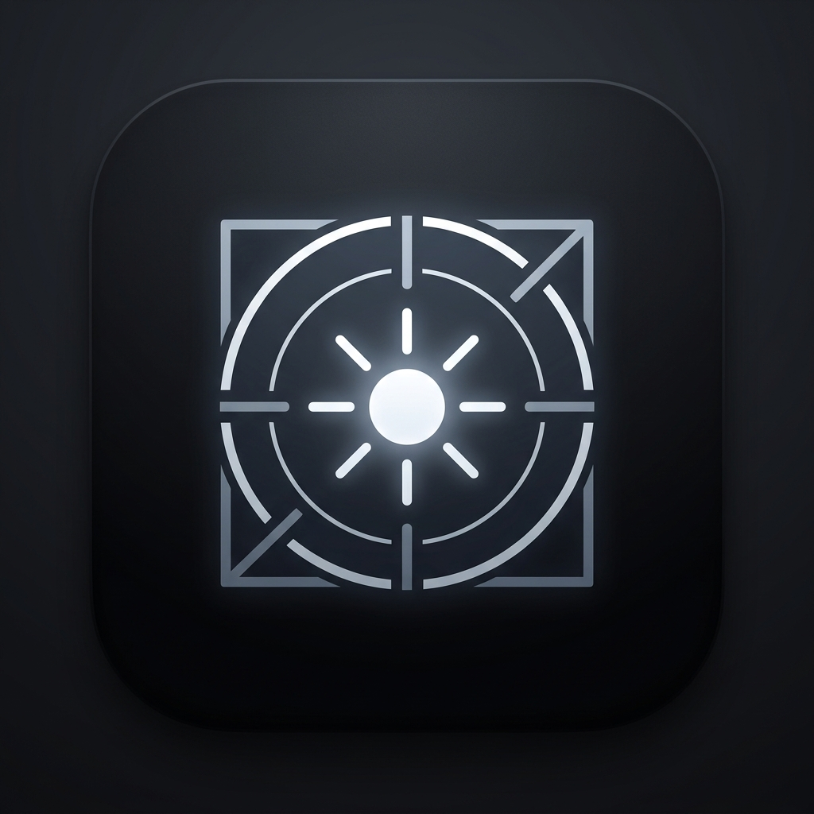

<div align="center">
  
  <h1>DayCraft — Everyday Life OS</h1>
  <p><strong>A minimalist, privacy-first daily command center for deep focus, habits, wellness, and ambient soundscapes.</strong></p>

  <p>
    <a href="#-key-features">Features</a> •
    <a href="#-architecture--tech-stack">Tech Stack</a> •
    <a href="#-google-play-store-ready">Google Play Store</a> •
    <a href="#-getting-started--local-run">Getting Started</a> •
    <a href="#-pushing-to-github">GitHub Setup</a>
  </p>

  <p>
    
    
    
  </p>
</div>

---

## 📖 Overview

**DayCraft** is an all-in-one daily productivity operating system engineered to eliminate app fatigue. Instead of juggling separate apps for Pomodoro timers, habit trackers, white noise generators, scratchpads, and water reminders, DayCraft unifies them into a single, high-contrast, distraction-free interface with instant local storage persistence.

---

## 🌟 Key Features

### 1. 🎯 Focus Studio & Fullscreen Zen Cockpit
* **Multi-Mode Timers:** Science-backed Pomodoro (25m), Flow (50m), Rest (5m/15m), and Custom min/sec timers.
* **Fullscreen Zen Cockpit HUD:** Distraction-free full screen mode featuring:
  * Active Goal Spotlight with **`✓ Mark Complete`** quick button.
  * Real-time session progress bar & percentage countdown.
  * 4-Tile metrics dashboard (Sessions progress dots `● ● ○ ○`, focus minutes, hydration quick sip, and streak).
  * Next Up checklist task preview.
  * Live **Minutes & Seconds** on-the-fly time setter (`-5m`, `+1m`, `+10s`, custom inputs).
* **Loud Multi-Tone Alarm with Stop Button:** Bypasses silent mode via Web Audio media channel with rapid beeps, heavy vibration, and a dedicated **`🔕 Stop Alarm`** button.
* **Lock Screen & MediaSession Integration:** Live countdown displayed on Android lock screens and notification shades.

### 2. 🎧 Ambient Soundscape Studio & Sleep Timer
* **100% Procedural Synthesis:** Generates audio natively using Web Audio API (zero bulky MP3 downloads).
* **5 Soundscapes:** 🌧️ Rainfall, ☕ Cafe Ambience, 🌲 Forest Sanctuary, 🌊 Ocean Waves, 🎧 432Hz Alpha Waves.
* **Continuous Loop & Sleep Timer:** Choose `∞ Continuous` or set sleep timers (`15m`, `30m`, `60m`) with smooth 3-second audio fade-outs.
* **One-Tap Reset:** Zeroes all audio sliders back to 0% with one click.

### 3. 💧 Hydration & 20-20-20 Wellness
* **Custom Daily Water Goal:** Set any target (e.g. 2500ml, 3500ml) by tapping the goal badge.
* **Flexible Water Logging:** Quick buttons (`+150ml`, `+250ml`, `+500ml`, `+750ml`) + custom amount logger.
* **20-20-20 Eye Break HUD:** Fullscreen 20-second circular countdown ring for eye strain relief.

### 4. ⚡ Daily Goal Morning Kickoff & Habits
* **Morning Kickoff Popup:** Prompts user on app launch to lock in today's **#1 Main Focus Goal**, daily water target, and focus sessions.
* **Past Goals History Dropdown:** Re-use previously successful goals with one tap.
* **Streak Analytics:** 7-Day Consistency Pulse tracking.

### 5. 🧰 Offline Everyday Multi-Toolbox
* **📝 Auto-saving Markdown Scratchpad** with 1-click copy.
* **💰 Daily Expense & Budget Logger**.
* **🧮 Tip & Bill Splitter Stepper**.

---

## 🛠️ Architecture & Tech Stack

```
daycraft-app/
├── index.html                   # Core application layout & Fullscreen overlays
├── manifest.json                # PWA & Android installation manifest
├── PLAYSTORE_PUBLISH_GUIDE.md   # Google Play Store publishing instructions
├── assets/
│   └── logo.png                 # Official 512x512 app icon
├── css/
│   ├── main.css                 # Design system tokens, Inter typography, theme variables
│   ├── components.css           # Component styles (Zen Cockpit, soundscapes, timers)
│   └── responsive.css           # Mobile & tablet layout optimizations
├── js/
│   ├── store.js                 # Reactive state store with automatic localStorage sync
│   ├── audio.js                 # Web Audio API procedural sound synthesizer & loud alarm
│   ├── app.js                   # Application coordinator & event delegation
│   ├── modules/
│   │   ├── briefing.js          # Clock, greeting, daily kickoff popup, past goals
│   │   ├── focus.js             # Pomodoro engine, Zen Cockpit HUD, media session
│   │   ├── wellness.js          # Hydration tracking, custom goals, 20-20-20 eye breaks
│   │   ├── tasks.js             # Daily task checklist & category filters
│   │   ├── toolbox.js           # Scratchpad, spend logger, tip calculator
│   │   └── reflection.js        # Evening reflection & weekly pulse
│   └── utils/
│       ├── confetti.js          # Canvas particle physics reward engine
│       └── permissions.js       # WakeLock, Notifications, Haptic Vibration API
└── android/                     # Android Studio & Gradle project files
    ├── build.gradle             # Root Gradle build script
    ├── gradle.properties        # AndroidX & JVM optimization flags
    └── app/
        ├── build.gradle         # Application module with TargetSDK 34 (Android 14)
        └── src/main/
            └── AndroidManifest.xml # Permissions & launcher configurations
```

---

## 📱 Google Play Store Ready

DayCraft is fully configured for Google Play Store deployment:
* **Package Name:** `com.daycraft.app`
* **Target SDK:** `34` (Android 14)
* **Min SDK:** `24` (Android 7.0)
* **App Bundle (`.aab`) Ready:** Run `./gradlew bundleRelease` in the `android` folder.
* Refer to [`PLAYSTORE_PUBLISH_GUIDE.md`](PLAYSTORE_PUBLISH_GUIDE.md) for signing keys, store listing copy, and submission steps.

---

## 🚀 Getting Started / Local Run

DayCraft is zero-dependency and runs instantly in any modern web browser:

```bash
# 1. Open index.html directly in your browser:
start index.html

# 2. Or serve via any static web server:
npx serve .
# Or Python:
python -m http.server 3000
```

---

## 📤 Pushing to GitHub

To push this project to your new GitHub repository, run the following commands in your terminal:

```bash
# 1. Initialize Git repository
git init

# 2. Add all files and create initial commit
git add .
git commit -m "feat: initial release of DayCraft Everyday Life OS v1.0.0"

# 3. Rename branch to main
git branch -M main

# 4. Link your remote GitHub repository (replace with your repo URL)
git remote add origin https://github.com/YOUR_USERNAME/daycraft.git

# 5. Push code to GitHub
git push -u origin main
```

---

## 🔒 Privacy Guarantee

DayCraft is **100% private and offline-first**. All notes, goals, timers, and wellness logs remain strictly stored on your device's `localStorage`. No accounts, no cloud databases, and zero tracking scripts.
